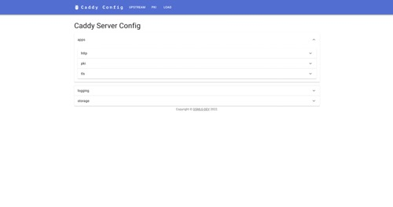
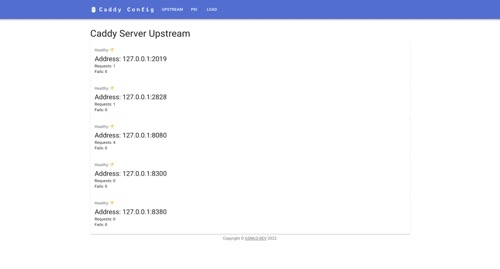
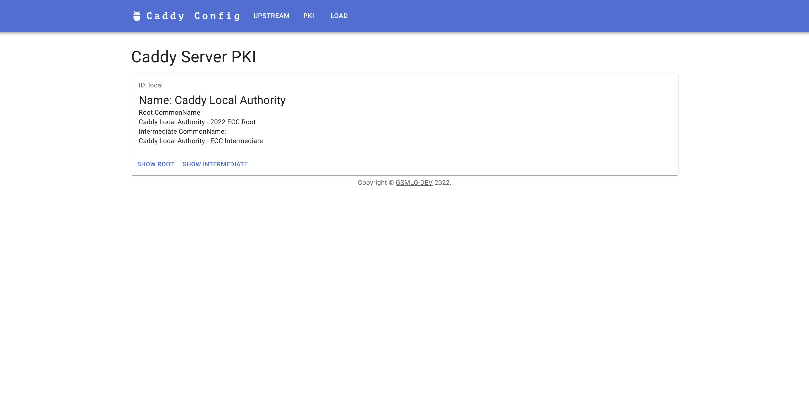
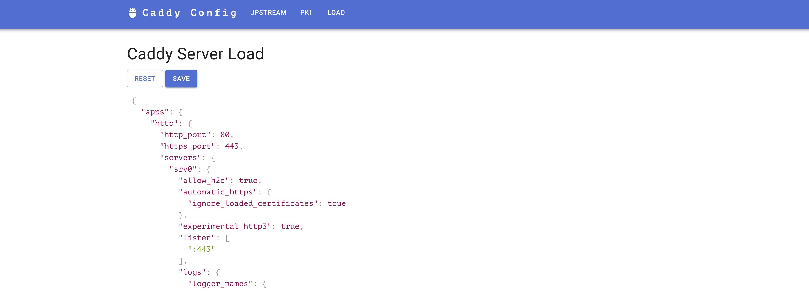
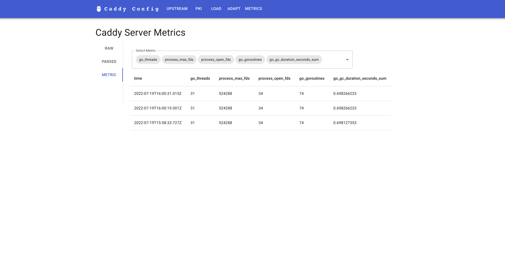

# caddy-admin-ui

Add a caddy http directive to serve a web ui for admin api.

## How to use

Build caddy with this package

```bash
xcaddy build --with github.com/gsmlg-dev/caddy-admin-ui@main
```

Add a http config

```
{
        admin localhost:2021
}

:2022 {
    route {
        caddy_admin_ui
        reverse_proxy localhost:2021 {
            header_up Host localhost:2021
        }
    }
}
```

## Feature

- Show Server Config
- Show Upstream
- Show PKI
- Load Server Config and Save Config to Server
- View Metrics from "/metrics"

## Screenshots






